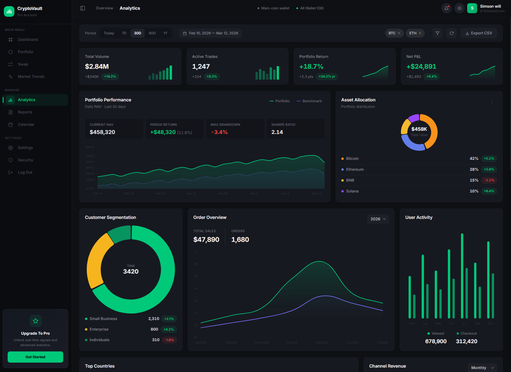
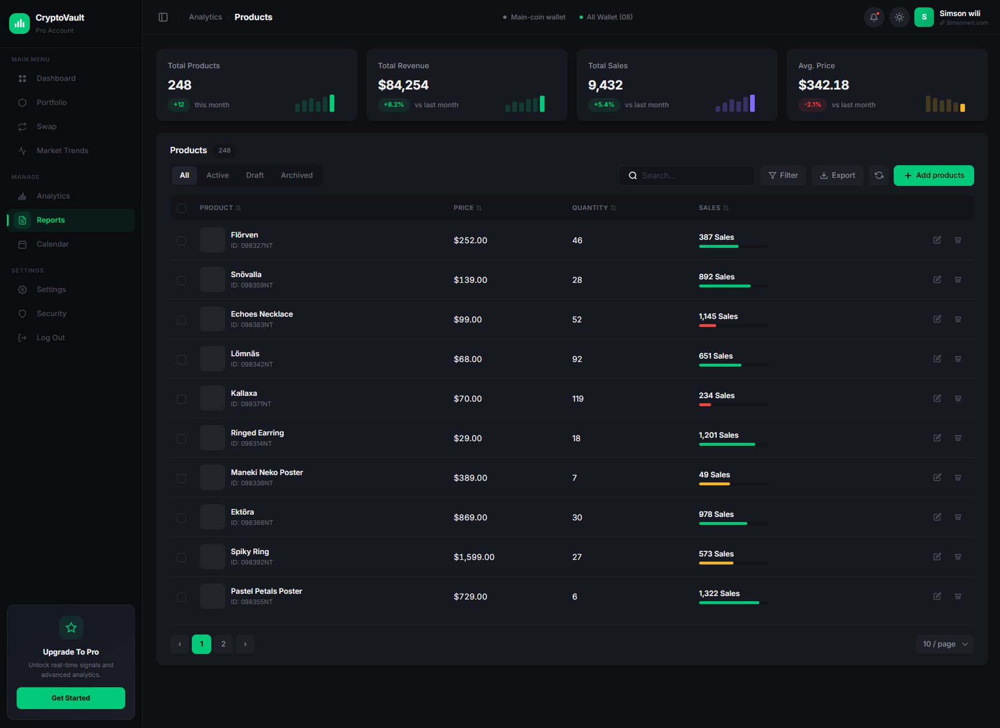
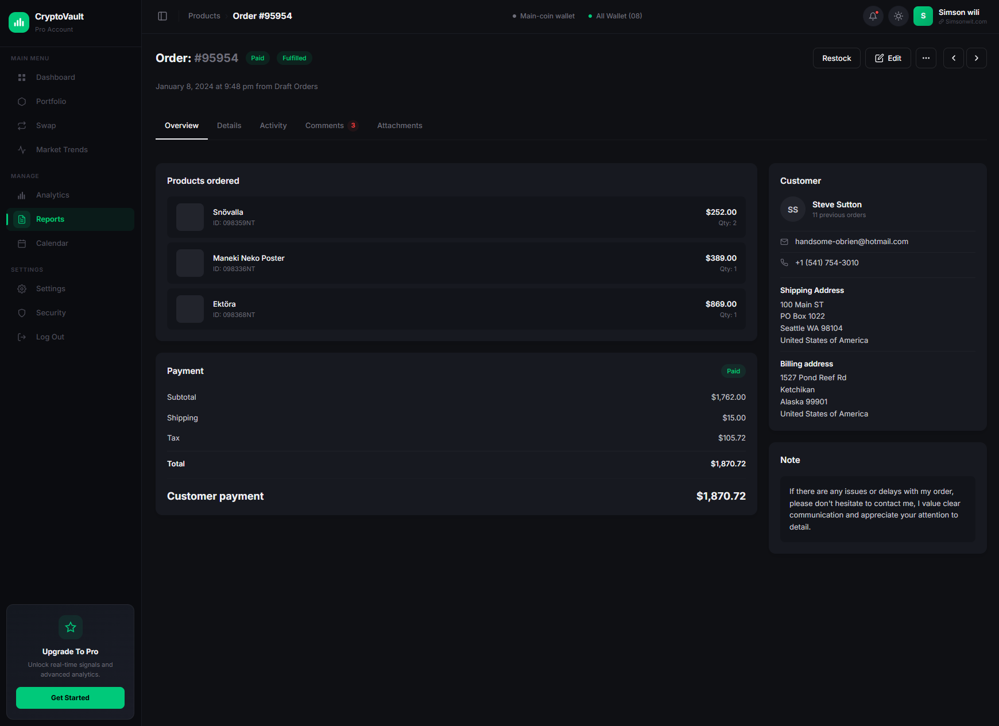
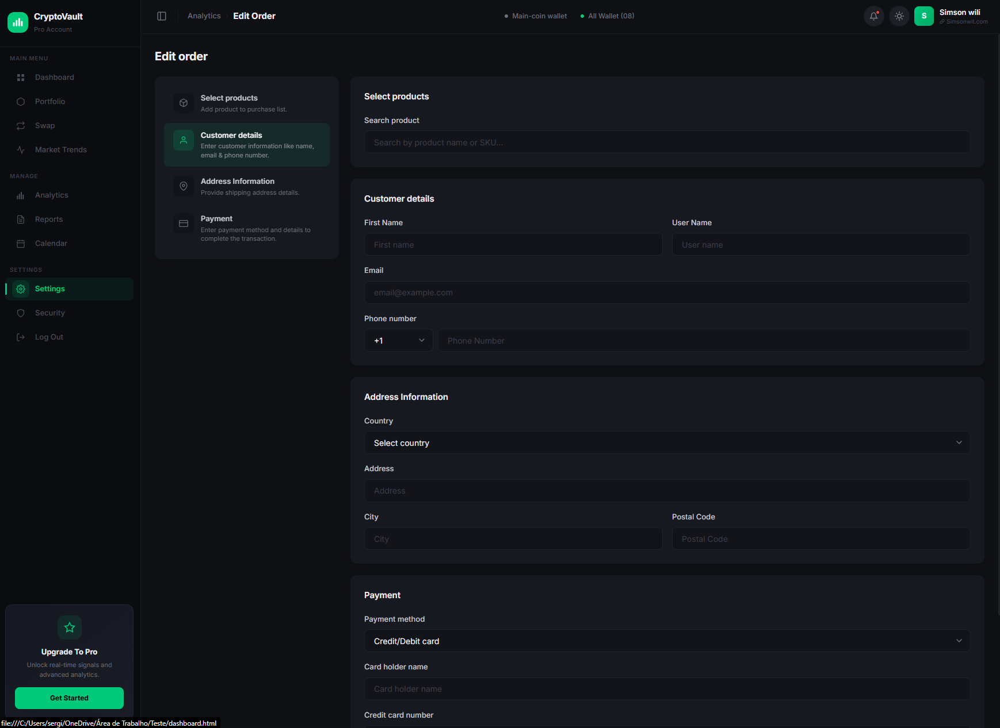
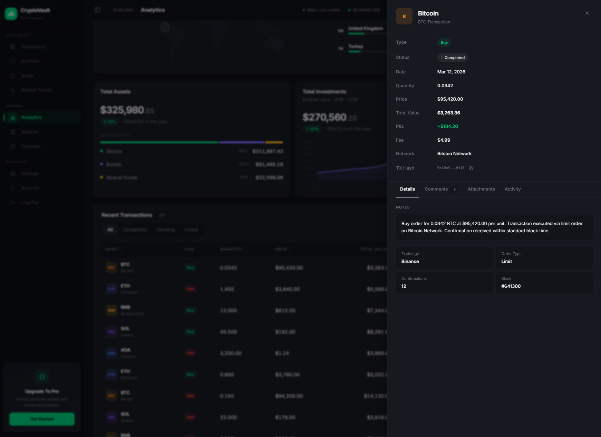

# iGreen Dashboard — CryptoVault Design System

A production-ready crypto dashboard built with a complete design system and an **MCP Server** that enables AI agents to generate pixel-perfect, consistent UI pages autonomously.

> **Live Demo:** [View on Vercel](https://igreen-dashboard.vercel.app)

---

## Preview

| Dashboard / Analytics | Product List |
|:---:|:---:|
|  |  |

| Order Detail | Edit / Forms |
|:---:|:---:|
|  |  |

| Drawer |
|:---:|
|  |

---

## Pages

| Page | File | Description |
|------|------|-------------|
| Dashboard | `dashboard.html` | KPI cards, analytics charts, segmentation, activity, revenue |
| Analytics | `analytics.html` | Same as Dashboard (canonical source) |
| Products | `products.html` | KPI grid + full data table with filters, sort, pagination |
| Order Detail | `order-detail.html` | 5-tab detail page: Overview, Details, Activity, Comments, Attachments |
| New Order | `order.html` | Step-nav form page with validation, toggles, action footer |
| Market Trends | `market-trends.html` | Filter bar + chart grid (line, bar, doughnut, radar) |

All pages share:
- Sidebar navigation (expandable/collapsible)
- Glass-effect topbar with theme toggle (dark/light)
- Responsive layout with CSS custom properties (190+ design tokens)
- Chart.js 4.4.0 with custom legends

---

## Design System (CSS Architecture)

```
theme/
├── dark.css        ← 190+ tokens (surfaces, foreground, brand, status, overlays, shadows)
├── light.css       ← Light theme overrides
├── components.css  ← 340+ classes (all components, states, validation)
├── tokens.css      ← Shared tokens (spacing, radius, typography, z-index)
└── main.css        ← Tailwind v4 entry point (imports all above)

dist/
└── styles.css      ← Compiled + minified output (loaded by all pages)
```

---

## MCP Server (v2.2.1)

The `igreendashboard-design-mcp/` folder contains a **Model Context Protocol server** that exposes the entire design system to AI agents.

### What the MCP provides

| Category | Count | Examples |
|----------|-------|---------|
| **Resources** | 19 | Colors, typography, layout, states, rules, component docs, page templates |
| **Tools** | 6 | `get_token`, `list_tokens`, `validate_css`, `suggest_component`, `generate_theme_css`, `get_file_structure` |
| **Prompts** | 3 | `new-page`, `new-component`, `review-ui` |
| **Component types** | 24 | card, button, table, drawer, badge, chart, detail-page, edit-page, etc. |

### Install on Claude Desktop

Add to your `claude_desktop_config.json`:

```json
{
  "mcpServers": {
    "igreen-design": {
      "command": "node",
      "args": ["C:/FULL/PATH/TO/igreendashboard-design-mcp/src/index.js"]
    }
  }
}
```

> **Tip:** Replace `C:/FULL/PATH/TO/` with the actual absolute path to the cloned repo.

### Install on Claude Code (CLI)

```bash
# Local project (stdio transport)
claude mcp add igreen-design -- node /path/to/igreendashboard-design-mcp/src/index.js

# Or via HTTP (if deployed)
claude mcp add igreen-design --transport http --url https://YOUR-DEPLOY-URL/mcp
```

### Install on Cursor IDE

Add to `.cursor/mcp.json` in your project:

```json
{
  "mcpServers": {
    "igreen-design": {
      "command": "node",
      "args": ["/path/to/igreendashboard-design-mcp/src/index.js"]
    }
  }
}
```

### Install on Windsurf / Cline / Other IDEs

Most MCP-compatible editors support either **stdio** or **HTTP** transport:

**Stdio (local):**
```json
{
  "command": "node",
  "args": ["/path/to/igreendashboard-design-mcp/src/index.js"]
}
```

**HTTP (deployed):**
```
URL: https://YOUR-DEPLOY-URL/mcp
```

---

## Usage Examples

### Example 1: Create a new page from scratch

```
Prompt to AI:
"Create a new 'Customers' page with a KPI grid showing total customers,
active users, churn rate, and revenue per user. Below the KPIs, add a
data table with columns: Name, Email, Status, Plan, Last Active, Actions.
Follow the iGreen design system."

The AI will automatically:
1. Read page-templates.md → copy Template 2 (table page)
2. Read component-card.md → build KPI cards with correct tokens
3. Read component-table.md → build the table with toolbar, filters, pagination
4. Use suggest_component("table") → get exact CSS classes and structure
5. Use generate_theme_css() → ensure all tokens are available
6. Apply rules.md → consistent naming, spacing, states
```

### Example 2: Duplicate and customize an existing page

```
Prompt to AI:
"Duplicate the order-detail.html page to create an 'Invoice Detail' page.
Change the tabs to: Summary, Line Items, Payment History, Notes.
Replace the products list with an invoice line items table.
Follow the iGreen design system."

The AI will:
1. Read order-detail.html as reference
2. Read component-detail-page.md → understand .od-* patterns
3. Adapt the 5-tab structure to 4 custom tabs
4. Reuse .od-grid, .od-card, .od-detail-section patterns
5. Add a table inside the "Line Items" tab using component-table.md patterns
6. Validate with validate_css() → ensure no design violations
```

### Example 3: Build a form/edit page

```
Prompt to AI:
"Create an 'Edit Product' page with a step navigation (Basic Info,
Pricing, Inventory, Images) and form fields for each section.
Include toggles for 'Published' and 'Featured'. Add Save/Cancel buttons."

The AI will:
1. Read component-edit-page.md → get .form-layout, .form-nav patterns
2. Read component-forms.md → get input, select, toggle, validation CSS
3. Use suggest_component("edit-page") → get complete spec
4. Build the page with .form-section cards and .form-row grids
5. Apply states.md → focus, validation, disabled states
```

### Example 4: Create a chart dashboard

```
Prompt to AI:
"Create a 'Market Analysis' page with a filter bar (7D/30D/90D/1Y presets),
two line charts comparing BTC and ETH prices, a doughnut chart for portfolio
allocation, and a stat row showing total value, 24h change, and volume."

The AI will:
1. Read page-templates.md Template 4 → chart page structure
2. Read component-charts.md → Chart.js config, palette, tooltip styling
3. Read component-legends.md → custom legend patterns (rich, value, simple)
4. Use suggest_component("chart") → get palette and container classes
5. Use suggest_component("filter-bar") → get preset/date-range structure
```

---

## Project Structure

```
igreen-dashboard/
├── index.html              ← Entry point (redirects to dashboard)
├── dashboard.html          ← Main dashboard page
├── analytics.html          ← Analytics (same as dashboard)
├── products.html           ← Product list with data table
├── order-detail.html       ← Order detail (5 tabs)
├── order.html              ← New order form page
├── market-trends.html      ← Charts and market analysis
│
├── dist/
│   └── styles.css          ← Compiled CSS (Tailwind v4 output)
│
├── theme/                  ← Design system source
│   ├── dark.css            ← Dark theme tokens
│   ├── light.css           ← Light theme overrides
│   ├── components.css      ← All component styles (340+ classes)
│   ├── tokens.css          ← Shared tokens
│   └── main.css            ← Tailwind entry point
│
├── components/             ← 8 standalone component showcases
│   ├── button/
│   ├── card/
│   ├── kpi-card/
│   ├── badge/
│   ├── pagination/
│   ├── table/
│   ├── filter-bar/
│   └── drawer/
│
├── prints/                 ← Dashboard preview screenshots
│
├── igreendashboard-design-mcp/   ← MCP Server
│   ├── src/
│   │   ├── index.js              ← Server (stdio + HTTP transport)
│   │   └── resources/            ← 19 markdown design docs
│   ├── Dockerfile
│   └── package.json
│
└── package.json            ← Root (Tailwind build scripts)
```

---

## Development

```bash
# Clone the repo
git clone https://github.com/snksergio/igreen-dashboard.git
cd igreen-dashboard

# Install dependencies
npm install
cd igreendashboard-design-mcp && npm install && cd ..

# Watch CSS changes (dev mode)
npm run dev

# Build CSS (production)
npm run build

# Run MCP server locally (stdio)
npm run mcp:start

# Run MCP server (HTTP on port 3000)
npm run mcp:http
```

---

## Deploy

### Vercel (Static Dashboard)

1. Push this repo to GitHub
2. Import the repo on [Vercel](https://vercel.com)
3. Framework preset: **Other**
4. Build command: `npm run build`
5. Output directory: `.` (root — static HTML files)
6. Deploy

All HTML pages will be served as static files. The `index.html` redirects to `dashboard.html`.

### MCP Server (Railway / Render)

The MCP server can be deployed separately for remote AI agent access:

1. Deploy the `igreendashboard-design-mcp/` folder to Railway or Render
2. Use the Dockerfile included
3. Set `PORT` env var if needed (default: 3000)
4. Connect via HTTP: `https://your-deploy-url/mcp`

---

## Tech Stack

- **CSS:** Tailwind CSS v4 + Custom Properties (190+ design tokens)
- **Charts:** Chart.js 4.4.0 with custom legend system
- **Fonts:** Inter (Google Fonts)
- **MCP:** @modelcontextprotocol/sdk + Express (dual transport)
- **Theme:** Dark/Light with localStorage persistence

---

## License

MIT
